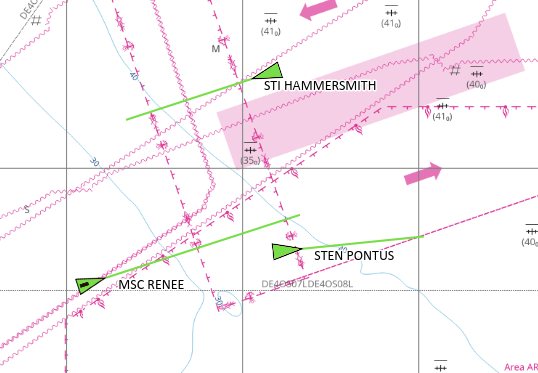
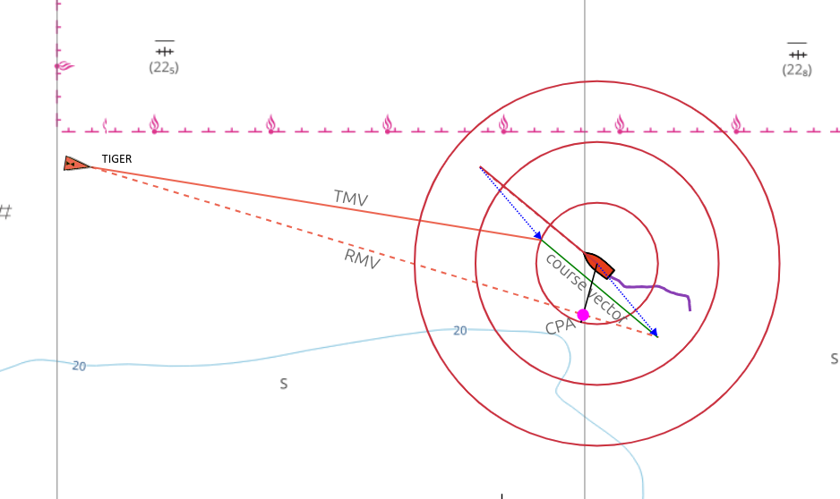
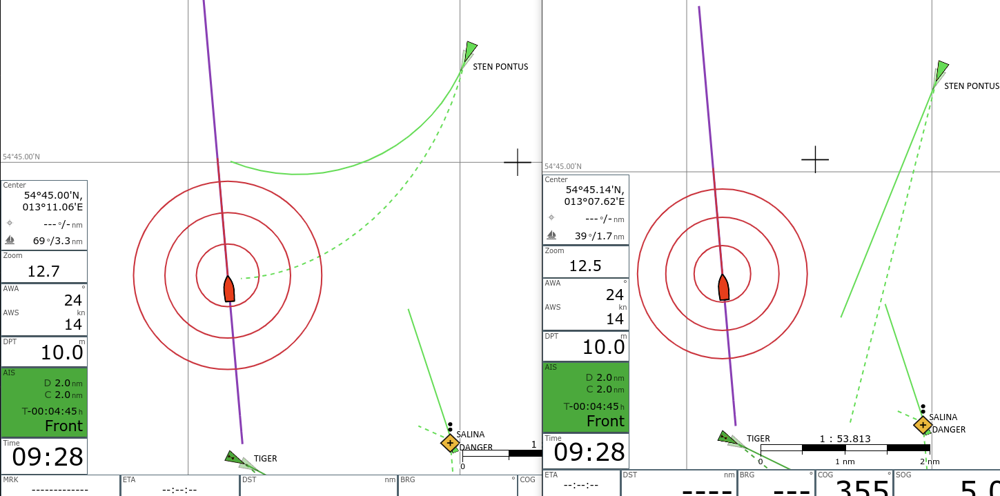

# Motion Vectors

Eine grundsätzliche Einführung in das Thema true und relative motion vectors und wie diese in der Navigation verwendet werden, ist zu finden unter

- https://msi.nga.mil/Publications/RNMB (Seite 59)
- https://www.youtube.com/watch?v=8YUic4LdWFg

## True Motion Vectors

AvNav stellt für AIS-Targets deren voraussichtlichen Track über Grund dar, wenn settings->AIS->use-course-vector aktiviert ist. Dazu wird ausgehend von der zuletzt bekannten Position des Targets eine Linie gezeichnet in Richtung des Kurs-über-Grund (COG) des Targets und der Länge Fahrt-über-Grund (SOG) multipliziert mit boat-course-vector-length. Diese Linie ist der sog. *true motion vector*, kurz TMV.

## Relative Motion Vectors

Zusätzlich können in AvNav *relative motion vectors* dargestellt werden. Dazu in settings->AIS->relative-motion-vector-range einen Wert größer als Null setzen, dann werden für Targets, die sich im Umkreis dieser Distanz befinden zusätzlich RMVs als gestrichelte Linien angezeigt.

Der RMV zeigt die Bewegung des Targets *relativ* zum eigenen Schiff, er ergibt sich als Differenz zwischen TMV und dem eigenen Kurs-Vektor, sodass TMV, RMV und der eigene Kurs-Vektor ein Dreieck bilden. Zeigt der RMV eines Targets direkt auf das eigene Schiff, dann besteht die Gefahr einer Kollision. Ebenso kann man die Lage des CPA direkt aus dem RMV ablesen, man fällt das Lot vom eigenen Schiff auf den RMV. 

Die RMVs entsprechen den Spuren, die die Targets auf einem Radarschirm hinterlassen würden.

## Gekrümmte Vektoren

Aktiviert man settings->AIS->curved-vectors, so wird eine in den AIS-Daten vorhandene rate-of-turn (ROT) ausgewertet und die Drehung des Targets bei der Darstellung der Vektoren berücksichtigt. Die TMVs und RMVs werden dann als gekrümmte Linien dargestellt. Die gekrümmten Vektoren zeigen eine potenzielle Kollision ggf. viel früher an als die ungekrümmten Vektoren.

----

# Motion vectors

A basic introduction to the topic of true and relative motion vectors and how they are used in navigation can be found at

- https://msi.nga.mil/Publications/RNMB (page 59)
- https://www.youtube.com/watch?v=8YUic4LdWFg

## True motion vectors

AvNav displays the estimated track over ground for AIS targets if settings->AIS->use-course-vector is activated. A line is drawn from the last known position of the target in the direction of the course over ground (COG) of the target with the length of the course over ground (SOG) multiplied by boat-course-vector-length. This line is the so-called *true motion vector*, or TMV for short.

## Relative motion vectors

In addition, *relative motion vectors* can be displayed in AvNav. To enable this, set a value greater than zero in settings->AIS->relative-motion-vector-range, then RMVs are also displayed as dashed lines for targets that are within this distance.

The RMV shows the movement of the target *relative* to the own ship, it results as the difference between TMV and the own course vector, so that TMV, RMV and the own course vector form a triangle. If the RMV of a target points directly at your own ship, there is a risk of collision. The position of the CPA can also be read directly from the RMV; the crossing of a line perpendicular to the RMV going through your own ship with the RMV.

The RMVs correspond to the tracks that the targets would leave on a radar screen.

## Curved vectors

If you activate settings->AIS->curved-vectors, a rate-of-turn (ROT) present in the AIS data is evaluated and the rotation of the target is taken into account when displaying the vectors. The TMVs and RMVs are then displayed as curved lines. The curved vectors may indicate a potential collision much earlier than the uncurved vectors.

